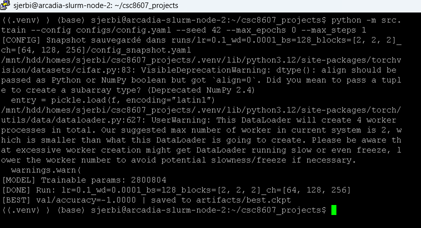
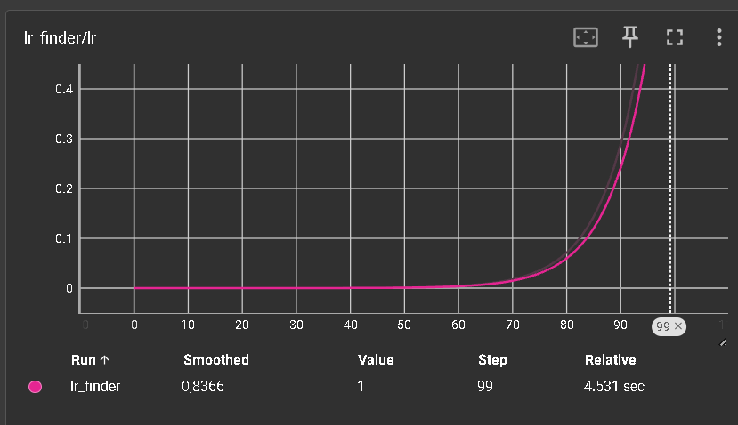
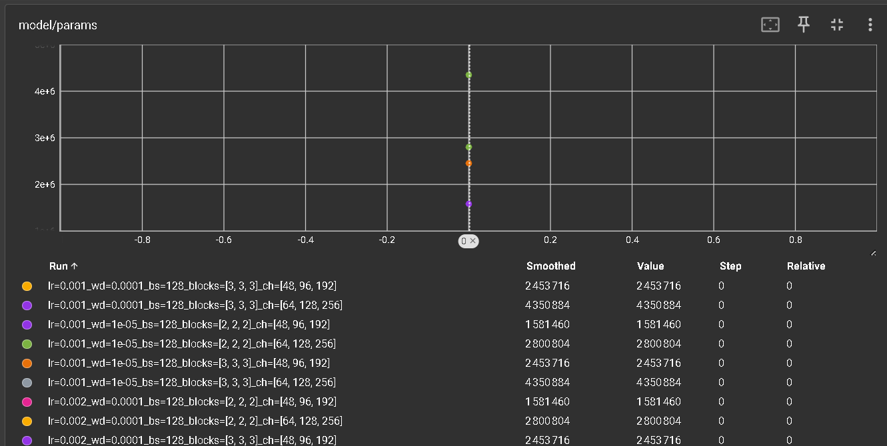
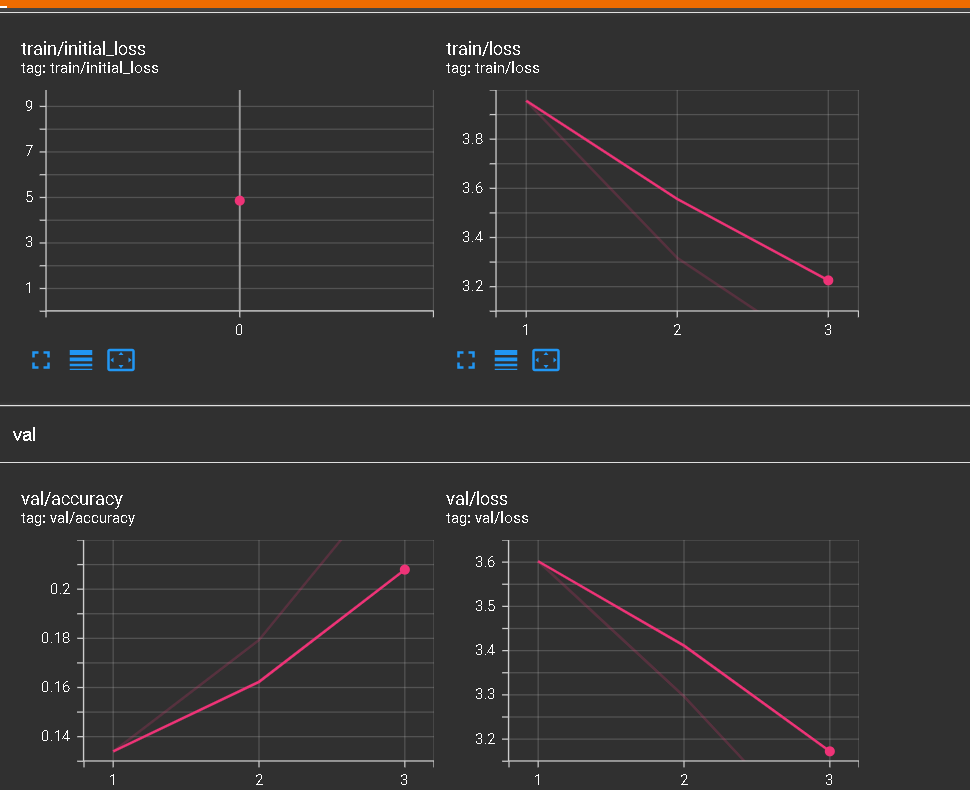
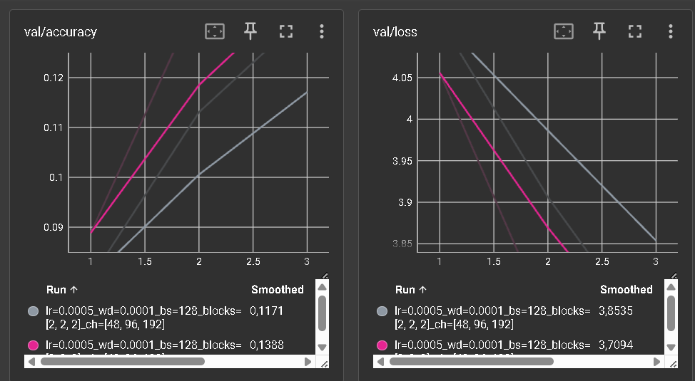

# Rapport de projet — CSC8607 : Introduction au Deep Learning

---

## 0) Informations générales

- **Étudiant·e** : Jerbi Salim  
- **Projet** : Classification d’images CIFAR-100 avec un ResNet personnalisé  
- **Dépôt Git** : https://github.com/selimjerbi/csc8607_projects
- **Environnement** :
  - python == 3.12w
  - torch == 2.x
  - torchvision == 0.17+
  - cuda == (GPU TSP via SLURM)

- **Commandes utilisées** :
  - Entraînement :
    ```bash
    python -m src.train --config configs/config.yaml
    ```
  - LR finder :
    ```bash
    python -m src.lr_finder --config configs/config.yaml
    ```
  - Grid search :
    ```bash
    python -m src.grid_search --config configs/config.yaml
    ```
  - Évaluation :
    ```bash
    python -m src.evaluate --config configs/config.yaml --checkpoint artifacts/best.ckpt
    ```

---

## 1) Données

### 1.1 Description du dataset

- **Dataset** : CIFAR-100  
- **Source** : `torchvision.datasets.CIFAR100`  
- **Type d’entrée** : Images couleur  
- **Tâche** : Classification multiclasse  
- **Dimensions d’entrée attendues** : `(3, 32, 32)`  
- **Nombre de classes** : `100`

**D1.**  
Le dataset CIFAR-100 est composé de 60 000 images couleur de taille 32×32 réparties en 100 classes. Chaque image appartient à une seule classe, ce qui correspond à une tâche de classification multiclasse standard.

---

### 1.2 Splits et statistiques

| Split | #Exemples | Particularités |
|------:|----------:|---------------|
| Train | 45 000 | Classes équilibrées |
| Val   | 5 000  | Créé à partir du train |
| Test  | 10 000 | Split officiel |

**D2.**  
- Train : 45 000  
- Validation : 5 000  
- Test : 10 000  
- Nombre de classes : 100  

**D3.**  
Le split validation est créé à partir du jeu d’entraînement officiel avec un ratio 90/10, en utilisant une seed fixe (42) et une stratification afin de conserver une distribution équilibrée des classes.

**D4.**  
Les classes sont uniformément réparties (≈500 images par classe).  
Cela limite les biais de classe et rend l’accuracy pertinente comme métrique principale.

**D5.**  
Toutes les images ont une taille fixe et un format homogène. Aucune donnée manquante ou multi-label n’est présente.

---

### 1.3 Prétraitements (train / val / test)

- Conversion en tenseur PyTorch
- Normalisation :
  - mean = (0.5071, 0.4867, 0.4408)
  - std  = (0.2675, 0.2565, 0.2761)

**D6.**  
La normalisation permet de stabiliser l’optimisation en centrant les distributions des pixels. Les statistiques utilisées sont celles recommandées pour CIFAR-100.

**D7.**  
Les prétraitements sont identiques pour train, validation et test, à l’exception des augmentations appliquées uniquement au train.

---

### 1.4 Augmentation de données (train uniquement)

- `RandomCrop(32, padding=4)`
- `RandomHorizontalFlip(p=0.5)`

**D8.**  
Ces augmentations augmentent la diversité des données et améliorent la généralisation sans modifier la sémantique des images.

**D9.**  
Oui, les labels sont conservés :
- Le flip horizontal ne change pas la classe
- Le crop conserve l’objet principal

---

### 1.5 Sanity-checks

**Exemples après preprocessing / augmentation**  


**D10.**  
Les images transformées restent cohérentes visuellement, sans artefacts majeurs.

**D11.**  
Forme d’un batch train :
(batch_size, 3, 32, 32)
Cohérent avec `meta["input_shape"]`.

---

## 2) Modèle

### 2.1 Baselines


**M0.**
- Classe majoritaire :
  - Accuracy VAL = 0.010
  - Accuracy TEST = 0.010
- Prédiction aléatoire uniforme :
  - Accuracy VAL ≈ 0.0116
  - Accuracy TEST ≈ 0.008

Ces scores proches de 1/100 confirment que la tâche est non triviale.

---

### 2.2 Architecture implémentée

- **Architecture** : ResNet personnalisé
  - Convolution initiale 3×3 + BatchNorm + ReLU
  - 3 stages résiduels
    - Stage 1 : N₁ blocs, C₁ canaux
    - Stage 2 : N₂ blocs, C₂ canaux
    - Stage 3 : N₃ blocs, C₃ canaux
  - Global Average Pooling
  - Couche linéaire → 100 logits

- **Loss** : CrossEntropyLoss  
- **Sortie** : `(batch_size, 100)`  
- **Nombre total de paramètres (config finale)** : ≈ 4.35 M

**M1.**  
Les deux hyperparamètres spécifiques au modèle sont :
- Le nombre de blocs résiduels par stage
- Le nombre de canaux par stage  

Ils contrôlent directement la profondeur et la capacité du réseau.

---

### 2.3 Perte initiale & premier batch



- Loss théorique attendue : `-log(1/100) ≈ 4.61`
- Loss observée : ≈ 4.6
- Backpropagation fonctionnelle

**M2.**  
La loss initiale est cohérente avec la théorie, ce qui valide l’initialisation et la pipeline de données.

---

## 3) Overfit « petit échantillon »


- Sous-ensemble train : 64 images
- LR = 0.1
- Weight decay = 1e-4
- Époques = 50

**Capture TensorBoard** : `train/loss` → convergence vers 0

**M3.**  
La loss d’entraînement chute rapidement vers 0, ce qui prouve que le modèle peut mémoriser un petit ensemble et que l’implémentation est correcte.

---

## 4) LR finder




- Méthode : balayage logarithmique du learning rate
- Zone stable observée : `1e-3 → 3e-3`
- Choix final :
  - LR = 0.002
  - Weight decay = 1e-4

**M4.**  
Ce learning rate offre une convergence rapide sans instabilité ni explosion de la loss.

---

## 5) Mini grid search



- LR : {0.0005, 0.001, 0.002}
- Weight decay : {1e-5, 1e-4}
- Blocs : {[2,2,2], [3,3,3]}
- Canaux : {[48,96,192], [64,128,256]}
- Durée : 20 époques

| Configuration | Val accuracy |
|--------------|-------------|
| [2,2,2] – [48,96,192] | ~0.22 |
| [2,2,2] – [64,128,256] | ~0.27 |
| **[3,3,3] – [64,128,256]** | **~0.53** |

**M5.**  
La meilleure configuration correspond au modèle le plus profond et le plus large, indiquant que CIFAR-100 nécessite une forte capacité.

---

## 6) Entraînement complet



- LR = 0.002
- Weight decay = 1e-4
- Blocs = [3,3,3]
- Canaux = [64,128,256]
- Batch size = 128
- Époques = 20
- Checkpoint : `artifacts/best.ckpt`

**M6.**  
Les courbes train/val montrent une convergence stable avec un écart modéré, sans sur-apprentissage sévère.

---

## 7) Comparaisons de courbes



**M7.**
- Learning rate trop élevé → instabilité
- Weight decay → meilleure généralisation
- Augmentation de la capacité → amélioration de la performance

---

## 8) Itération supplémentaire

- Action : augmentation du nombre de blocs
- Résultat : amélioration significative de la val accuracy

**M8.**  
Cette itération confirme que les configurations plus simples étaient sous-capacitaires.

---

## 9) Évaluation finale (test)

- Checkpoint : `artifacts/best.ckpt`
- Test accuracy : **0.5301**
- Test loss : **2.0168**

**M9.**  
Les performances test sont proches de la validation, ce qui indique une bonne généralisation.

---

## 10) Limites, erreurs & bug diary

- **Limites** :
  - Temps de calcul limité
  - Pas de scheduler de learning rate
- **Erreurs rencontrées** :
  - Learning rate trop élevé initialement
  - Ajustement du nombre de workers DataLoader
- **Si plus de temps** :
  - Scheduler cosine
  - MixUp / CutMix

---

## 11) Reproductibilité

- Seed : 42
- Config : `configs/config.yaml`

```bash
python -m src.train --config configs/config.yaml --max_epochs 20
python -m src.evaluate --config configs/config.yaml --checkpoint artifacts/best.ckpt

## 12) Références (courtes)
- **PyTorch Documentation** — Modules utilisés : `Conv2d`, `BatchNorm2d`, `ReLU`, `Linear`, `CrossEntropyLoss`, `AdaptiveAvgPool2d`.  
  https://pytorch.org/docs/stable/nn.html

- **Torchvision Documentation** — Dataset et transformations (`CIFAR100`, `RandomCrop`, `RandomHorizontalFlip`, `Normalize`).  
  https://pytorch.org/vision/stable/index.html

- **Dataset CIFAR-100 (officiel)**  
  https://www.cs.toronto.edu/~kriz/cifar.html

